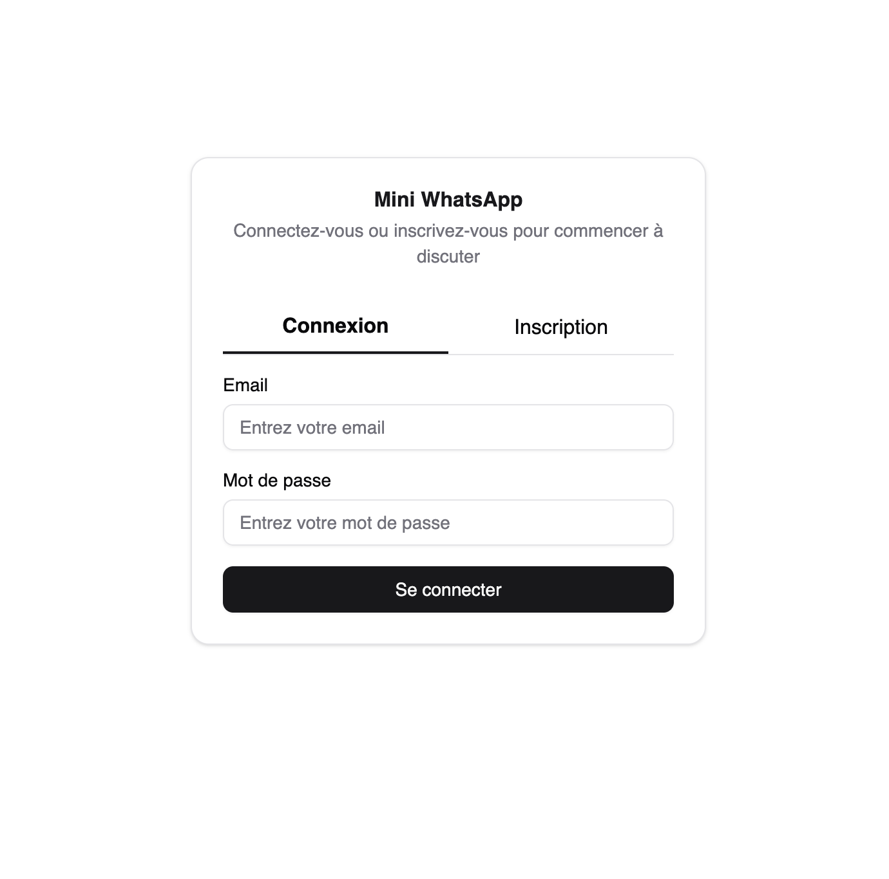
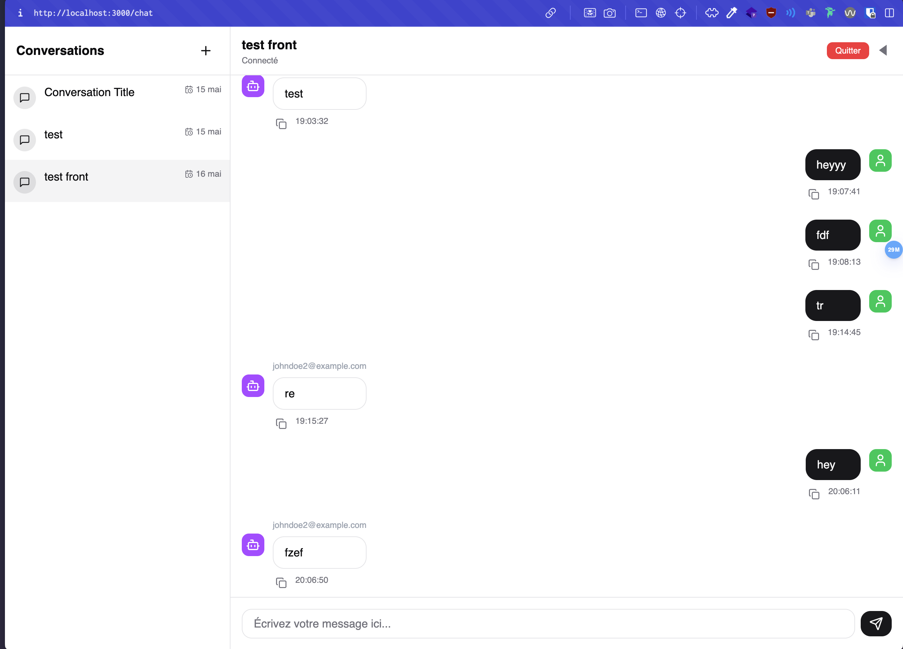

# Nest-chat

## Description

Nest-chat est une application de chat. Elle permet aux utilisateurs de discuter en temps réel dans des groupes de discussion. 
Ce projet est conçu dans le cadre d'un projet d'étude à l'ESGI.
Nest-chat à été réalisé en moins de 8h. La qualité du code est discutable et a été fait un peu à la va-vite. Désolé pour ça 😝.

## Technologies utilisées

- NestJS
- Socket.IO
- Sqlite
- Prisma
- Vue.js
- TypeScript
- Tailwind CSS

## Installation

```bash
# Clone the repository
git clone git@github.com:ZeRiix/nest-chat.git
cd nest-chat
# Install dependencies
npm install
# Make prisma migrations + apply migrations
npm -w backend run prisma:make-migration && npm -w backend run prisma:apply-migration
# Start application
npm run dev
```

## Informations

- L'application est divisée en deux parties : le backend (NestJS) et le frontend (Vue.js).

Port backend : 1506
Port frontend : 3000

## Fonctionnalités

- Inscription et connexion des utilisateurs
- Création de groupes de discussion
- Envoi et réception de messages en temps réel


## Images

Page de connexion et d'inscription:


Page de discussion:


## Contributeurs

- [William FLORENTIN](https://github.com/ZeRiix)
- [Mathieu CAMPANI](https://github.com/mathcovax)